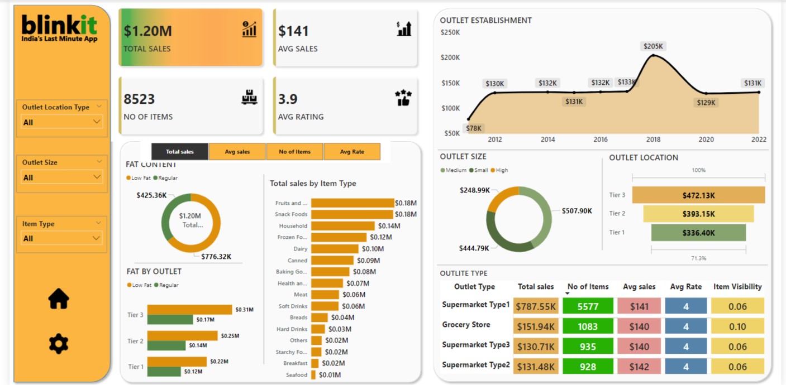

# Blinkit Sales Performance Analysis--PowerBI Dashboard
 
# Project Summary
This Power BI dashboard delivers an in-depth analysis of Blinkit’s sales performance, customer satisfaction, and inventory distribution across various outlets. The primary objective is to uncover actionable insights and identify opportunities for optimization by leveraging key performance indicators (KPIs) and advanced data visualizations.

# Project Workflow
1. **Requirement Gathering & Business Analysis:** Defined project scope and business needs.
2. **Data Exploration & Connection:** Connected to data sources and conducted an initial walkthrough.
3. **Data Cleaning & Quality Check:** Ensured data accuracy and integrity through rigorous cleaning and validation processes.
4. **Data Modeling:** Structured data models to support robust analysis.
5. **Data Processing & Transformation:** Applied data processing techniques to prepare the data for analysis.
6. **DAX Calculations:** Developed custom calculations to derive meaningful insights.
7. **Dashboard Design & Layout:** Created an intuitive and visually appealing dashboard interface.
8. **Visualization Development:** Crafted charts and visual elements to represent data insights effectively.
9. **Insight Generation & Reporting:** Synthesized findings to generate actionable business insights.

# Key KPIs and Metrics Analyzed  
- **Total Sales:** Aggregate revenue generated from all items sold.
- **Average Sales:** Revenue per transaction.
- **Number of Items:** Count of distinct items sold.
- **Average Rating:** Average customer satisfaction score for purchased items.
 
## Business Objectives - (Charts Requirements)
The analysis was centered around the following key objectives:
1. **Total Sales by Fat Content**
   - **Objective:** Assess the impact of fat content on total sales to understand customer preferences.
   - **Visualization:** Donut Chart.
2. **Total Sales by Item Type**
   - **Objective:** Evaluate the performance of different item categories in driving total sales.
   - **Visualization:** Bar Chart.
3. **Fat Content by Outlet for Total Sales**
   - **Objective:** Compare total sales across outlets segmented by fat content to identify trends and patterns.
   - **Visualization:** Stacked Column Chart.
4. **Total Sales by Outlet Establishment Year**
   - **Objective:** Analyze the influence of outlet age on sales performance.
   - **Visualization:** Line Chart.
5. **Sales by Outlet Size**
   - **Objective:** Explore the correlation between outlet size and total sales to optimize resource allocation.
   - **Visualization:** Donut/Pie Chart.
6. **Sales by Outlet Location**
   - **Objective:** Map and assess geographic sales distribution across various locations.
   - **Visualization:** Funnel Map.
7. **Comprehensive Metrics by Outlet Type**
   - **Objective:** Provide a holistic view of key metrics (Total Sales, Average Sales, Number of Items, Average Rating) segmented by outlet type.
   - **Visualization:** Matrix Card.

# Snapshot of the Blinkit Insights

  

